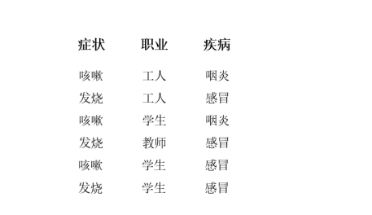

# MachineLearning-Exp

---
Test1

计算题 答案附HomeworkOne.pdf

---
Test2

计算题 答案附HomeworkTwo.pdf

---
Test3

试编程实现累积 BP 算法，在西瓜数据集 2.0 上(用训练数据)训练一个单隐层网络，用验证
集计算出均方误差。要自己实现，不能直接调用现成的库函数。

---
Test4

1.下载并安装 libsvm，http://www.csie.ntu.edu.tw/~cjlin/libsvm/
在西瓜数据集 3.0a 上分别用线性核训练一个 SVM。用正类 1-6 和负类 9-14 作为训练集，其余作为测试集。C 取不同
的值，其它参数设为默认值。作出测试正确率随 C 取值变化的图，C=[1 100 10000 10^6
10^8]。

2.换成高斯核(宽度设为 1)，重复上题的步骤。

3.考虑用线性支持向量机对如下两类可分数据进行分类：
 +1：(1,1),(2,2),(2,0)
 -1: (0,0), (1,0), (0,1)
 (1) 在图中做出这 6 个训练点，构造具有最大间隔的超平面，写出三个平面的方程。
 
 (2) 哪些是支持向量？
 
---
Test5

1.以西瓜数据集 2.0（见教材 76 页表 4.1）中样本 1--16 为训练集训练一个朴素贝叶斯分类器，对
测试样本 17 进行分类。请写出详细的计算过程。

2.某家医院上午来了六个门诊病人，其信息如下表，现在来了一位咳嗽的学生，请用朴素贝叶斯
方法计算他患上感冒的概率有多大。

